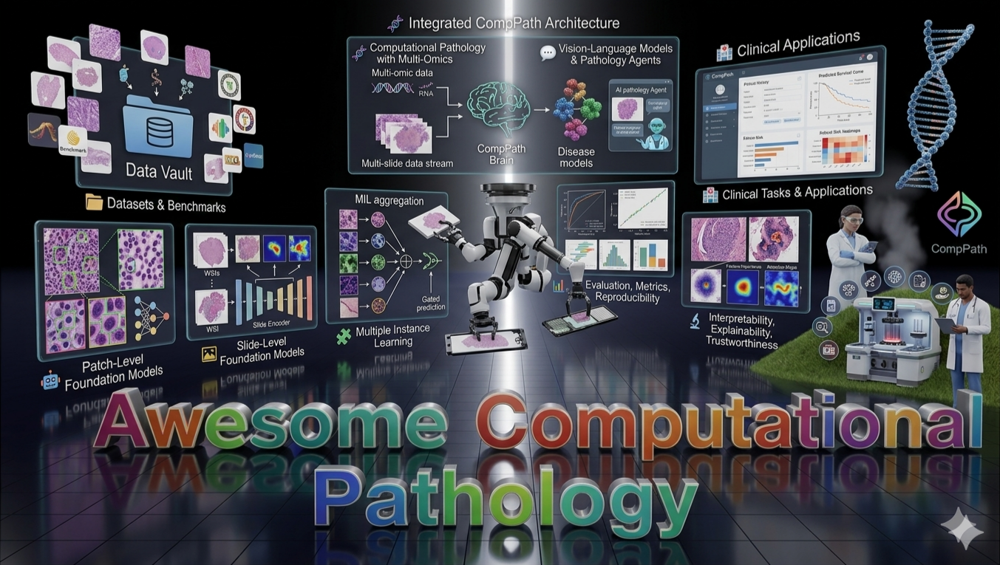

# Awesome-Computational-Pathology

<div align="center">


[](https://github.com/sindresorhus/awesome)
[](#)
[](LICENSE.txt)
[](CONTRIBUTING.md)

**📜 A Curated List of Awesome Works in Computational Pathology, Aiming to Serve as a One-stop Resource for Researchers, Practitioners, and Enthusiasts Interested in Computational Pathology.**  
*Focused on papers, benchmarks, datasets, and open-source repositories for modern computational pathology.*

<p align="center">
  
</p>


*Photo Credit: [Gemini-Nano-Banana🍌](https://aistudio.google.com/models/gemini-2-5-flash-image)*.
</div>

---

## 🚩 News & Updates

_Major updates and repository announcements are shown below._

🚧 **[Ongoing] Repository Refocus** — This list is being rebuilt around **computational pathology**, with the original awesome-list visual style preserved.

🗂️ **[Ongoing] Curated by Topic** — Papers are organized by **datasets, MIL, patch-level FMs, slide-level FMs, multi-omics, pathology VLMs, and clinical applications**.

💡 **[Ongoing] Contributions Welcome** — If you would like to add missing papers, repos, or benchmarks, feel free to open a PR.

📌 **[Ongoing] Repository Support** — If this list helps your research, consider sharing the repository and citing it in your own awesome lists.

---

## Overview

- 🎯 [Aim of the Project](#aim-of-the-project)
- 📖 [Surveys, Reviews, and Perspectives](#surveys-reviews-and-perspectives)
- 🖨️ [Digital Slide Scanners and File Formats](#digital-slide-scanners-and-file-formats)
- 🗂️ [Datasets and Benchmarks](#datasets-and-benchmarks)
- 🧩 [Multiple Instance Learning](#multiple-instance-learning)
- 🌐 [Federated Learning in Computational Pathology](#federated-learning-in-computational-pathology)
- 🤖 [Patch-Level Foundation Models](#patch-level-foundation-models)
- 🖼️ [Slide-Level Foundation Models and Slide Encoders](#slide-level-foundation-models-and-slide-encoders)
- 🧫 [Cytology and Cervical Cytology in Pathology AI](#cytology-and-cervical-cytology-in-pathology-ai)
- 🎨 [Generative Models for Computational Pathology](#generative-models-for-computational-pathology)
- 🧬 [Computational Pathology with Multi-Omics](#computational-pathology-with-multi-omics)
- 💬 [Vision-Language Models and Pathology Agents](#vision-language-models-and-pathology-agents)
- 🧱 [Dense Prediction in Computational Pathology](#dense-prediction-in-computational-pathology)
- 🏥 [Clinical Tasks and Applications](#clinical-tasks-and-applications)
- 🧭 [Pathology Image Registration and Spatial Alignment](#pathology-image-registration-and-spatial-alignment)
- 🔬 [Interpretability, Explainability, and Trustworthiness](#interpretability-explainability-and-trustworthiness)
- 🚀 [Resources, Toolkits, and Open-Source Projects](#resources-toolkits-and-open-source-projects)
- 🔭 [Future Trends and Hot Topics](#future-trends-and-hot-topics)
- 🙏 [Acknowledgements](#acknowledgements)
- 📝 [Citation](#citation)

---

## Aim of the Project

Computational pathology has rapidly evolved from handcrafted image analysis pipelines to **whole-slide learning**, **foundation models**, **multimodal pathology-language systems**, and **morphology-to-omics prediction**.  
At the same time, the literature has become fragmented across pathology, machine learning, computer vision, spatial biology, and multimodal AI.

This repository aims to:

- 🔍 **Organize** representative papers, datasets, toolkits, and repositories in computational pathology
- 🗺️ **Provide** a clean map of the field from classical WSI learning to modern foundation models
- 🤝 **Bridge** communities working on digital pathology, multimodal medicine, spatial biology, and medical AI
- 📚 **Serve** as a compact reading list for new researchers and a practical reference for experienced practitioners
- 🚀 **Track** open-source progress in pathology AI, especially around benchmarks and reproducibility

---

## Surveys, Reviews, and Perspectives

- **Computational Pathology: Challenges and Promises for Tissue Analysis**. [](https://www.sciencedirect.com/science/article/abs/pii/S0895611111000383)
- **Digital Pathology and Artificial Intelligence**. [](https://www.thelancet.com/journals/lanonc/article/PIIS1470-2045%2819%2930154-8/abstract)
- **Artificial Intelligence in Digital Pathology — New Tools for Diagnosis and Precision Oncology**. [](https://www.nature.com/articles/s41571-019-0252-y)
- **Computational Pathology Definitions, Best Practices, and Recommendations for Regulatory Guidance: A White Paper from the Digital Pathology Association**. [](https://pathsocjournals.onlinelibrary.wiley.com/doi/10.1002/path.5331)
- **Digital Pathology and Computational Image Analysis in Nephropathology**. [](https://www.nature.com/articles/s41581-020-0321-6)
- **Artificial Intelligence and Computational Pathology**. [](https://www.nature.com/articles/s41374-020-00514-0)
- **Digital Pathology and Artificial Intelligence in Translational Medicine and Clinical Practice**. [](https://www.nature.com/articles/s41379-021-00919-2)
- **AI in Computational Pathology of Cancer: Improving Diagnostic Workflows and Clinical Outcomes?**. [](https://www.annualreviews.org/content/journals/10.1146/annurev-cancerbio-061521-092038)
- **Artificial Intelligence for Digital and Computational Pathology**. [](https://www.nature.com/articles/s44222-023-00096-8)
- **Computational Pathology in 2030: a Delphi Study Forecasting the Role of AI in Pathology Within the Next Decade**. [](https://www.thelancet.com/journals/ebiom/article/PIIS2352-3964%2822%2900609-0/fulltext)
- **Applications of Digital Pathology in Cancer: A Comprehensive Review**. [](https://www.annualreviews.org/content/journals/10.1146/annurev-cancerbio-062822-010523)
- **Toward Explainable Artificial Intelligence for Precision Pathology**. [](https://www.annualreviews.org/content/journals/10.1146/annurev-pathmechdis-051222-113147)
- **Artificial Intelligence in Digital Pathology: a Systematic Review and Meta-analysis of Diagnostic Test Accuracy**. [](https://www.nature.com/articles/s41746-024-01106-8)
- **Pathology in the Era of Generative AI**. [](https://www.thelancet.com/journals/landig/article/PIIS2589-7500%2824%2900157-2/fulltext)
- **Artificial Intelligence in Pathology: Advancing Large Models for Scalable Applications**. [](https://www.annualreviews.org/content/journals/10.1146/annurev-biodatasci-103123-095814)
- **Application of Artificial Intelligence and Digital Tools in Cancer Pathology**. [](https://www.thelancet.com/journals/landig/article/PIIS2589-7500%2825%2900115-3/fulltext)

---

## Digital Slide Scanners and File Formats

- **OpenSlide** — open-source library for reading wsi formats across scanner vendors. [](https://pmc.ncbi.nlm.nih.gov/articles/PMC3815078/) [](https://github.com/openslide/openslide)
- **opensdpc** — Python library for processing SDPC whole-slide images, extended from OpenSlide. [](https://github.com/WonderLandxD/opensdpc)
- **Bio-Formats** — widely used library for reading and converting microscopy formats. [](https://www.openmicroscopy.org/bio-formats/)
- **DICOM** — official overview of DICOM WSI and pathology imaging standardization. [](https://dicom.nema.org/dicom/dicomwsi/)
---

## Datasets and Benchmarks

<em>Representative datasets and evaluation benchmarks for computational pathology.</em>

- **TCGA** — the most widely used public source for multi-cancer WSIs and linked clinical/molecular data. [](https://portal.gdc.cancer.gov/)
- **CPTAC** — proteogenomic cohorts with matched histology and omics data. [](https://proteomics.cancer.gov/programs/cptac)
- **CAMELYON16** — lymph node metastasis detection benchmark. [](https://camelyon16.grand-challenge.org/Data/)
- **CAMELYON17** — whole-slide and patient-level metastasis benchmark. [](https://camelyon17.grand-challenge.org/)
- **PANDA** — large-scale prostate cancer grading benchmark. [](https://panda.grand-challenge.org/) [](https://github.com/DIAGNijmegen/panda-challenge)
- **PatchCamelyon (PCam)** — patch-level metastasis classification derived from CAMELYON. [](https://github.com/basveeling/pcam)
- **MHIST** — minimalist colorectal polyp classification dataset. [](https://bmirds.github.io/MHIST/)
- **BRACS** — breast carcinoma subtyping benchmark with WSIs and ROIs. [](https://pmc.ncbi.nlm.nih.gov/articles/PMC9575967/) [](https://github.com/histocartography/hact-net)
- **PanNuke** — pan-cancer nuclei instance segmentation and classification dataset. [](https://arxiv.org/abs/2003.10778) [](https://github.com/TissueImageAnalytics/PanNuke-metrics)
- **NuCLS** — nucleus classification, localization, and segmentation dataset. [](https://github.com/PathologyDataScience/NuCLS)
- **CoNSeP** — colorectal nuclear segmentation and phenotype dataset used heavily in nuclei benchmarks. [](https://warwick.ac.uk/fac/cross_fac/tia/data/hovernet/)
- **Lizard** — large-scale colonic nuclear instance segmentation and classification benchmark. [](https://openaccess.thecvf.com/content/ICCV2021/html/Graham_Lizard_A_Large-Scale_Dataset_for_Colonic_Nuclear_Instance_Segmentation_and_Classification_ICCV_2021_paper.html)
- **HEST-1k / HEST-Benchmark** — histology + spatial transcriptomics benchmark. [](https://arxiv.org/abs/2406.16192) [](https://huggingface.co/datasets/MahmoodLab/hest) [](https://github.com/mahmoodlab/HEST)
- **PathMMU** — expert-level benchmark for pathology large multimodal models. [](https://arxiv.org/abs/2401.16355) [](https://github.com/PathMMU-Benchmark/PathMMU) [](https://huggingface.co/datasets/jamessyx/PathMMU)
- **PathBench** — multi-task, multi-organ benchmark for pathology foundation models. [](https://birkhoffkiki.github.io/PathBench/)
- **Patho-Bench** — standardized benchmark for pathology foundation models. [](https://github.com/mahmoodlab/Patho-Bench)
- **HISTAI** — open-access whole-slide pathology resource with expert annotations and models. [](https://arxiv.org/abs/2505.12120) [](https://github.com/HistAI/HISTAI)
- **MindLab-DP/Datasets** — practical collection of digital pathology datasets. [](https://github.com/MindLab-DP/Datasets)
- **TCGA Processing Pipeline for MIL** — practical WSI preprocessing pipeline for weak supervision. [](https://github.com/liupei101/Pipeline-Processing-TCGA-Slides-for-MIL)
- **OV-Bevacizumab** — Multi-modal ovarian cancer response prediction for Bevacizumab treatment. [](https://www.nature.com/articles/s41597-022-01127-6)
- **BCNB** — Large breast cancer nodule and biomarker dataset for diagnosis. [](https://bupt-ai-cz.github.io/BCNB/)
- **MUT-HET-RCC** — Intra-tumor heterogeneity and mutation prediction in renal cell carcinoma. [](https://doi.org/10.25452/figshare.plus.c.5983795)
- **HER2-Tumor-ROIs** — Annotated regions of interest for breast cancer HER2 scoring. [](https://www.cancerimagingarchive.net/collection/her2-tumor-rois/)
- **NADT-Prostate** — Prostate cancer dataset for neoadjuvant androgen deprivation therapy. [](https://www.medrxiv.org/content/10.1101/2020.09.29.20199711v1)
- **EBRAINS** — Ultra-high-resolution comprehensive whole-slide brain mapping dataset. [](https://doi.org/10.25493/WQ48-ZGX)
- **VisioMel** — Melanoma prediction and lymph node metastasis forecasting dataset. [](https://www.drivendata.org/competitions/148/visiomel-melanoma/)
- **IMP** — Multi-institutional pathology dataset for cervical and diverse tissue. [](https://rdm.inesctec.pt/dataset/nis-2023-008)
- **Selected Cohorts** — CPTAC diverse multi-cancer cohorts (BRCA, LUAD, GBM, etc.). [Cohorts](https://www.cancerimagingarchive.net/collections/)
- **CoNIC** — Large-scale colon nuclei identification and counting challenge dataset. [](https://www.sciencedirect.com/science/article/pii/S1361841522000755) [](https://zenodo.org/record/6559981)
- **PAIP** — Liver cancer segmentation and survival prediction pathology challenge. [](https://www.sciencedirect.com/science/article/pii/S1361841521000577) [](https://paip2019.grand-challenge.org/)
- **BACH** — Breast cancer histology classification and segmentation challenge dataset. [](https://www.sciencedirect.com/science/article/pii/S1361841518301789) [](https://iciar2018-challenge.grand-challenge.org/)
- **BCI** — H&E to IHC translation dataset for breast cancer. [](https://openaccess.thecvf.com/content/CVPR2022/html/Liu_Translating_From_HE_to_IHC_A_New_Trajectory_for_Translational_CVPR_2022_paper.html) [](https://github.com/bupt-ai-cz/BCI)
- **EBHI-Seg** — Digestive system tumor segmentation dataset for H&E slides. [](https://www.nature.com/articles/s41597-022-01435-y) [](https://figshare.com/articles/dataset/EBHI-Seg/19602495)
- **HEROHE** — HER2 status prediction from routine H&E breast WSIs. [](https://www.sciencedirect.com/science/article/pii/S1361841521002369) [](https://herohe.inesctec.pt/)
- **SICAPv2** — Prostate cancer grading dataset with expert Gleason annotations. [](https://ieeexplore.ieee.org/document/9144365) [](https://data.mendeley.com/datasets/9xxm58dvs3/1)
- **UniToPatho** — Colon cancer dataset addressing class imbalance and domain shift. [](https://arxiv.org/abs/2009.00650) [](https://zenodo.org/record/3934241)
- **NCT-CRC-HE-100K** — 100k colorectal patches for benchmarking patch-level encoders. [](https://zenodo.org/record/1214456)
- **GlaS** — Canonical benchmark for colon gland instance segmentation. [](https://www.sciencedirect.com/science/article/pii/S1361841516301736) [](https://warwick.ac.uk/fac/cross_fac/tia/data/glascontest/)
- **MoNuSeg** — Multi-organ nucleus segmentation benchmark. [](https://ieeexplore.ieee.org/document/8880654) [](https://monuseg.grand-challenge.org/)
- **MoNuSAC2020** — Multi-organ nuclei segmentation and classification benchmark. [](https://ieeexplore.ieee.org/document/9446924) [](https://monusac-2020.grand-challenge.org/)
- **TissueNet** — Large-scale cell segmentation benchmark across multiplexed modalities. [](https://www.nature.com/articles/s41592-021-01249-6) [](https://datasets.deepcell.org/)
- **OCELOT** — Cell detection dataset with tissue-region context. [](https://openaccess.thecvf.com/content/CVPR2023/html/Ryu_OCELOT_Overlapping_Cell_on_Tissue_Dataset_for_Histopathology_CVPR_2023_paper.html) [](https://github.com/lunit-io/ocelot-benchmark)
- **TCGA-TIL Maps** — Pan-cancer spatial tumor-infiltrating lymphocyte maps. [](https://www.cell.com/cell-reports/fulltext/S2211-1247(18)31438-5) [](https://www.cancerimagingarchive.net/analysis-result/til-maps/)
- **DigestPath** — Colonoscopy tissue segmentation and malignancy classification challenge. [](https://www.sciencedirect.com/science/article/pii/S1361841521003571) [](https://digestpath2019.grand-challenge.org/)
- **AGGC2022** — Large-scale prostate cancer Gleason scoring WSI dataset. [](https://aggc22.grand-challenge.org/)
- **TIGER** — Breast cancer TIL segmentation and WSI-level scoring challenge. [](https://tiger.grand-challenge.org/) [](https://github.com/DIAGNijmegen/tiger-challenge-eval)
- **Benchmarking SSL on Pathology** — Comprehensive SSL benchmarking across diverse pathology datasets. [](https://openaccess.thecvf.com/content/CVPR2023/html/Kang_Benchmarking_Self-Supervised_Learning_on_Diverse_Pathology_Datasets_CVPR_2023_paper.html) [](https://github.com/lunit-io/benchmark-ssl-pathology)

---

## Multiple Instance Learning

- **ABMIL** — attention-based deep multiple instance learning. [](https://arxiv.org/abs/1802.04712) [](https://github.com/AMLab-Amsterdam/AttentionDeepMIL)
- **CLAM** — clustering-constrained attention MIL for WSI classification. [](https://www.nature.com/articles/s41551-020-00682-w) [](https://github.com/mahmoodlab/CLAM)
- **DSMIL** — dual-stream MIL for WSI classification. [](https://arxiv.org/abs/2011.08939) [](https://github.com/binli123/dsmil-wsi)
- **TransMIL** — correlated MIL with transformers. [](https://proceedings.neurips.cc/paper/2021/hash/10c272d06794d3e5785d5e7c5356e9ff-Abstract.html) [](https://github.com/szc19990412/TransMIL)
- **HIPT** — hierarchical transformer for gigapixel pathology with slide-level aggregation. [](https://arxiv.org/abs/2206.02647) [](https://github.com/mahmoodlab/HIPT)
- **DTFD-MIL** — double-tier feature distillation MIL. [](https://openaccess.thecvf.com/content/CVPR2022/html/Zhang_DTFD-MIL_Double-Tier_Feature_Distillation_Multiple_Instance_Learning_for_Histopathology_Whole_CVPR_2022_paper.html) [](https://github.com/hrzhang1123/DTFD-MIL)
- **Patch-GCN** — graph-based context-aware WSI survival modeling. [](https://arxiv.org/abs/2107.13048) [](https://github.com/mahmoodlab/Patch-GCN)
- **DT-MIL** — deformable transformer for MIL on histopathology. [](https://link.springer.com/chapter/10.1007/978-3-030-87240-3_34) [](https://github.com/yfzon/DT-MIL)
- **SparseConvMIL** — sparse convolutional context-aware MIL. [](https://proceedings.mlr.press/v156/lerousseau21a.html) [](https://github.com/MarvinLer/SparseConvMIL)
- **HMIL** — hierarchical MIL for fine-grained WSI classification. [](https://arxiv.org/abs/2411.07660) [](https://github.com/ChengJin-git/HMIL)
- **MHIM-MIL** — masked hard instance mining for WSI classification. [](https://arxiv.org/abs/2307.10324) [](https://github.com/DearCaat/MHIM-MIL)
- **ILRA-MIL** — low-rank MIL for WSI classification. [](https://openreview.net/forum?id=8hH4Q3f8c2) [](https://github.com/lingxitong/MIL_BASELINE)
- **WiKG** — whole-slide image as a knowledge graph. [](https://arxiv.org/abs/2403.07719) [](https://github.com/WonderLandxD/WiKG)
- **CA-MIL** — context-aware MIL for WSI classification. [](https://openreview.net/forum?id=rzBskAEmoc) [](https://github.com/olgarithmics/ICLR_CAMIL)
- **AC-MIL** — attention-challenging MIL. [](https://arxiv.org/abs/2403.05351) [](https://github.com/dazhangyu123/ACMIL)
- **LongMIL** — long-contextual MIL for WSI analysis. [](https://arxiv.org/abs/2410.14195) [](https://github.com/invoker-LL/Long-MIL)
- **RRT-MIL** — feature re-embedding toward foundation model-level performance. [](https://openaccess.thecvf.com/content/CVPR2024/html/Tang_Feature_Re-Embedding_Towards_Foundation_Model-Level_Performance_in_Computational_Pathology_CVPR_2024_paper.html) [](https://github.com/DearCaat/RRT-MIL)
- **RetMIL** — retentive MIL for long histopathology sequences. [](https://papers.miccai.org/miccai-2024/657-Paper1723.html) [](https://github.com/Hongbo-Chu/RetMIL)
- **MambaMIL** — Mamba-based long sequence MIL for computational pathology. [](https://arxiv.org/abs/2403.06800) [](https://github.com/isyangshu/MambaMIL)
- **cDP-MIL** — robust MIL via cascaded Dirichlet process. [](https://arxiv.org/abs/2407.11448) [](https://github.com/HKU-MedAI/cDPMIL)
- **Lin-MIL** — linear attention MIL for scalable WSI analysis. [](https://arxiv.org/abs/2502.13417) [](https://github.com/charlotterchtr/Lin-MIL)
- **PackMIL** — pack-based MIL training framework for pathology. [](https://arxiv.org/abs/2502.12917) [](https://github.com/FangHeng/PackMIL)
- **ViLa-MIL** — dual-scale vision-language MIL for WSI classification. [](https://openaccess.thecvf.com/content/CVPR2024/html/Shi_ViLa-MIL_Dual-scale_Vision-Language_Multiple_Instance_Learning_for_Whole_Slide_Image_CVPR_2024_paper.html) [](https://github.com/Jiangbo-Shi/ViLa-MIL)
- **SI-MIL** — deep MIL for self-interpretability in gigapixel histopathology. [](https://openaccess.thecvf.com/content/CVPR2024/html/Bhattacharya_SI-MIL_Taming_Deep_MIL_for_Self-Interpretability_in_Gigapixel_Histopathology_CVPR_2024_paper.html) [](https://github.com/bmi-imaginelab/SI-MIL)
- **FG-VSI** — generalizable WSI classification via fine-grained visual-semantic interaction. [](https://openaccess.thecvf.com/content/CVPR2024/html/Li_Generalizable_Whole_Slide_Image_Classification_with_Fine-Grained_Visual-Semantic_Interaction_CVPR_2024_paper.html)
- **LNPL-MIL** — learning from noisy pseudo labels for WSI MIL. [](https://openaccess.thecvf.com/content/ICCV2023/html/Shao_LNPL-MIL_Learning_from_Noisy_Pseudo_Labels_for_Promoting_Multiple_Instance_ICCV_2023_paper.html)
- **MILBooster** — dual-scale multi-stage MIL framework via distribution and correlation. [](https://openaccess.thecvf.com/content/ICCV2023/html/Qu_Boosting_Whole_Slide_Image_Classification_from_the_Perspectives_of_Distribution_ICCV_2023_paper.html)
- **ZoomMIL** — differentiable zooming for MIL on whole-slide images. [](https://www.ecva.net/papers/eccv_2022/papers_ECCV/papers/136810689.pdf) [](https://github.com/histocartography/zoommil)
- **IBMIL** — interpretable intervention-based MIL overcoming confounding in WSIs. [](https://openaccess.thecvf.com/content/CVPR2022/html/Lin_Interventional_Multi-Instance_Learning_with_Deconfounded_Instance-Level_Prediction_CVPR_2022_paper.html) [](https://github.com/TencentAILabHealthcare/IBMIL)
- **ReMix** — general MIL data augmentation method for WSIs. [](https://openaccess.thecvf.com/content/ICCV2021/html/Yang_ReMix_Towards_Image_Mixup_for_Whole_Slide_Image_Classification_ICCV_2021_paper.html) [](https://github.com/Jiawei-Yang/ReMix)
- **PromptMIL** — prompting language-image models for pathology MIL. [](https://arxiv.org/abs/2303.03362) [](https://github.com/Zhenghui-Wu/PromptMIL)
- **Clinical-grade WSI** — large-scale weakly supervised WSI classification. [](https://www.nature.com/articles/s41591-019-0508-1)
- **DeepAttnMISL** — multi-scale attention-guided MIL for WSI cancer survival prediction. [](https://www.sciencedirect.com/science/article/pii/S1361841520300487) [](https://github.com/uta-smile/DeepAttnMISL)
- **CAMEL** — weakly supervised WSI segmentation via class activation maps. [](https://openaccess.thecvf.com/content_ICCV_2019/html/Li_Camel_A_Weakly_Supervised_Learning_Framework_for_Histopathology_Image_Segmentation_ICCV_2019_paper.html)
- **S4MIL** — structured state space sequence models for pathology MIL. [](https://proceedings.mlr.press/v227/fillioux24a.html) [](https://github.com/MICS-Lab/s4mil)
- **GTP** — graph-transformer fusing WSI graphs and ViTs for classification. [](https://ieeexplore.ieee.org/document/9779215) [](https://github.com/vkola-lab/tmi2022)
- **AMD-MIL** — agent aggregator with mask denoise for WSI analysis. [](https://arxiv.org/abs/2409.11664) [](https://github.com/sigsminx/AMD-MIL)
- **SAM-MIL** — spatial contextual aware MIL using SAM-guided WSI context. [](https://dl.acm.org/doi/10.1145/3664647.3681534) [](https://github.com/FangHeng/SAM-MIL)
- **Flow-MIL** — normalizing-flow latent feature space for WSI classification. [](https://openaccess.thecvf.com/content/ICCV2025/html/Ma_Flow-MIL_Constructing_Highly-expressive_Latent_Feature_Space_For_Whole_Slide_Image_ICCV_2025_paper.html)
- **PseMix** — pseudo-bag mixup augmentation for MIL-based WSI classification. [](https://arxiv.org/abs/2306.16180) [](https://github.com/liupei101/PseMix)
- **DGR-MIL** — diverse global representation learning for robust WSI MIL. [](https://arxiv.org/abs/2407.03575) [](https://github.com/ChongQingNoSubway/DGR-MIL)
- **FR-MIL** — distribution re-calibration based MIL with Transformer. [](https://pubmed.ncbi.nlm.nih.gov/39163176/) [](https://github.com/lingxitong/MIL_BASELINE)
- **MIL_BASELINE** — unified implementation hub for many pathology MIL methods. [](https://github.com/lingxitong/MIL_BASELINE)
- **MIL-Lab** — standardized MIL library with pretrained slide models. [](https://github.com/mahmoodlab/MIL-Lab)
- **MIL Tutorial** — hands-on tutorial for pathology MIL pipelines. [](https://github.com/guillaumejaume/mil-tutorial)

---
## Federated Learning in Computational Pathology

- **CPath-FL Review** — review of federated learning in computational pathology. [](https://www.sciencedirect.com/science/article/pii/S200103702400357X)
- **FLCP Review** — literature review of federated learning for computational pathology. [](https://www.spiedigitallibrary.org/journals/journal-of-medical-imaging/volume-12/issue-06/061412/Federated-learning-in-computational-pathology-a-literature-review/10.1117/1.JMI.12.6.061412.full)
- **HistoFL** — federated learning for WSI classification and survival prediction. [](https://www.sciencedirect.com/science/article/pii/S1361841521003431) [](https://github.com/mahmoodlab/HistoFL)
- **WSI-FL Tool** — federated training tool for WSI segmentation. [](https://www.sciencedirect.com/science/article/pii/S2153353922006952) [](https://github.com/SarderLab/federated_learning)
- **FedStain** — federated stain normalization for pathology. [](https://link.springer.com/chapter/10.1007/978-3-031-16434-7_2) [](https://github.com/MECLabTUDA/BottleGAN)
- **FedMM** — federated multimodal learning for computational pathology. [](https://arxiv.org/abs/2402.15858)
- **HistoFS** — federated WSI classification under non-IID shifts. [](https://openaccess.thecvf.com/content/CVPR2025/html/Raswa_HistoFS_Non-IID_Histopathologic_Whole_Slide_Image_Classification_via_Federated_Style_CVPR_2025_paper.html) [](https://github.com/lalakitchen/HistoFS)
- **PathFL** — federated pathology image segmentation across centers. [](https://www.sciencedirect.com/science/article/pii/S1361841525002178) [](https://github.com/yuanzhang7/PathFL)
- **RW-CPath-FL** — real-world federated learning for clinical pathology. [](https://www.sciencedirect.com/science/article/pii/S2153353925000501)

---

## Patch-Level Foundation Models

- **CTransPath** — transformer-based self-supervised pathology encoder. [](https://www.sciencedirect.com/science/article/abs/pii/S1361841522002043) [](https://github.com/Xiyue-Wang/TransPath)
- **RetCCL** — contrastive pathology patch representation model. [](https://www.sciencedirect.com/science/article/abs/pii/S1361841522002730) [](https://github.com/Xiyue-Wang/RetCCL)
- **HIPT** — hierarchical transformer for pathology images. [](https://arxiv.org/abs/2206.02647) [](https://github.com/mahmoodlab/HIPT)
- **Lunit-DINO** — self-supervised ViT for pathology. [](https://arxiv.org/abs/2212.04690) [](https://github.com/lunit-io/benchmark-ssl-pathology)
- **PLIP** — pathology vision-language pretraining model. [](https://www.nature.com/articles/s41591-023-02504-3) [](https://huggingface.co/vinid/plip)
- **PathoDuet** — pathology foundation model for H&E and IHC. [](https://arxiv.org/abs/2312.09894) [](https://github.com/openmedlab/pathoduet)
- **CONCH** — caption-based pathology foundation model. [](https://www.nature.com/articles/s41591-024-02856-4) [](https://huggingface.co/MahmoodLab/CONCH)
- **UNI** — general-purpose pathology foundation model. [](https://www.nature.com/articles/s41591-024-02857-3) [](https://huggingface.co/MahmoodLab/UNI)
- **UNI2-h** — second-generation pathology encoder from UNI. [](https://huggingface.co/MahmoodLab/UNI2-h)
- **Virchow** — clinical-grade pathology foundation model. [](https://www.nature.com/articles/s41591-024-03141-0) [](https://huggingface.co/paige-ai/Virchow)
- **Virchow2** — mixed-magnification pathology encoder. [](https://arxiv.org/abs/2408.00738) [](https://huggingface.co/paige-ai/Virchow2)
- **Phikon** — large-scale self-supervised pathology ViT. [](https://arxiv.org/abs/2309.16864) [](https://github.com/owkin/HistoSSLscaling)
- **Phikon-v2** — upgraded pathology foundation model. [](https://arxiv.org/abs/2409.09173) [](https://huggingface.co/owkin/phikon-v2)
- **H-Optimus-0** — open foundation model for histology. [](https://huggingface.co/bioptimus/H-optimus-0)
- **H-Optimus-1** — next-generation histology encoder. [](https://huggingface.co/bioptimus/H-optimus-1)
- **Hibou** — DINOv2-based pathology vision transformer. [](https://arxiv.org/abs/2406.05074) [](https://huggingface.co/histai/hibou-b)
- **Midnight** — efficient pathology foundation model. [](https://arxiv.org/abs/2504.05186) [](https://github.com/kaiko-ai/midnight)
- **OpenMidnight** — open reproduction of Midnight. [](https://github.com/MedARC-AI/OpenMidnight)
- **Path Foundation** — Google pathology patch encoder. [](https://huggingface.co/google/path-foundation)
- **BEPH** — BEiT-based pathology foundation model. [](https://www.nature.com/articles/s41467-025-57587-y) [](https://github.com/Zhcyoung/BEPH)
- **kaiko Pathology FMs** — large-scale pathology ViT family. [](https://arxiv.org/abs/2404.15217) [](https://github.com/kaiko-ai/towards_large_pathology_fms)
- **Prov-GigaPath** — pathology tile-level foundation encoder. [](https://www.nature.com/articles/s41586-024-07441-w) [](https://huggingface.co/prov-gigapath/prov-gigapath)
- **GPFM** — pathology foundation model toolkit. [](https://github.com/birkhoffkiki/GPFM)
- **MUSK** — multimodal pathology foundation model. [](https://www.nature.com/articles/s41586-024-08437-2) [](https://github.com/lilab-stanford/MUSK)
- **Digepath** — gastrointestinal pathology foundation model. [](https://arxiv.org/abs/2505.21928) [](https://huggingface.co/xtxx/Digepath)
- **PathOrchestra** — pathology foundation model for clinical tasks. [](https://arxiv.org/abs/2503.24345) [](https://github.com/yanfang-research/PathOrchestra)
- **PLUTO** — lightweight multi-scale pathology foundation model. [](https://arxiv.org/abs/2405.07905)
- **PLUTO-4** — next-generation PLUTO model family. [](https://arxiv.org/abs/2511.02826)
- **StainNet** — pathology foundation model for special stains. [](https://arxiv.org/abs/2512.10326) [](https://huggingface.co/JWonderLand/StainNet)
- **KEEP** — knowledge-enhanced pathology vision-language model. [](https://www.cell.com/cancer-cell/fulltext/S1535-6108(26)00058-9) [](https://huggingface.co/Astaxanthin/KEEP)
- **GenBio-PathFM** — pathology foundation model from public data. [](https://genbio.ai/papers/genbio-pathfm.pdf) [](https://huggingface.co/genbio-ai/genbio-pathfm)
- **Atlas 2** — clinical pathology foundation model family. [](https://arxiv.org/abs/2601.05148) [](https://www.aignostics.com/products/foundation-models)
- **GloPath** — entity-centric renal pathology foundation model. [](https://advanced.onlinelibrary.wiley.com/doi/10.1002/advs.202520580)
- **CerS-Path** — cervical subspecialty pathology foundation model. [](https://arxiv.org/abs/2510.10196)

---

## Slide-Level Foundation Models and Slide Encoders

- **Prov-GigaPath** — whole-slide foundation model trained on real-world pathology data. [](https://www.nature.com/articles/s41586-024-07441-w) [](https://github.com/prov-gigapath/prov-gigapath)
- **CHIEF** — clinical histopathology imaging evaluation foundation. [](https://www.nature.com/articles/s41586-024-07894-z) [](https://github.com/hms-dbmi/CHIEF)
- **TITAN** — multimodal whole-slide foundation model for pathology. [](https://www.nature.com/articles/s41591-025-03982-3) [](https://github.com/mahmoodlab/TITAN)
- **PANTHER** — morphological prototyping for slide foundation model. [](https://arxiv.org/abs/2405.11643) [](https://github.com/mahmoodlab/PANTHER)
- **TANGLE** — transcriptomics-guided slide representation learning. [](https://arxiv.org/abs/2405.11618) [](https://github.com/mahmoodlab/TANGLE)
- **PRISM** — multimodal generative foundation model for slide-level histopathology. [](https://arxiv.org/abs/2405.10254) [](https://huggingface.co/paige-ai/Prism)
- **THREADS** — molecular-driven foundation model for oncologic pathology. [](https://arxiv.org/abs/2501.16652)
- **FEATHER** — lightweight supervised slide foundation models. [](https://arxiv.org/abs/2506.09960) [](https://github.com/mahmoodlab/MIL-Lab)
- **Democratizing_WSI / GigaSSL** — optimized slide-level representations for TCGA-scale analysis. [](https://github.com/trislaz/Democratizing_WSI)
- **CPath-Omni** — unified multimodal foundation model spanning patches and WSIs. [](https://arxiv.org/abs/2412.12077) [](https://github.com/PathFoundation/CPath-Omni)
- **SlideChat** — large vision-language assistant with slide-level reasoning capability. [](https://arxiv.org/abs/2410.11761) [](https://github.com/uni-medical/SlideChat)
- **mSTAR** — knowledge-enhanced whole-slide foundation model. [](https://www.nature.com/articles/s41467-025-66220-x) [](https://huggingface.co/Wangyh/mSTAR)
- **MADELEINE** — multistain pretraining for slide representation learning. [](https://link.springer.com/chapter/10.1007/978-3-031-73414-4_2) [](https://huggingface.co/MahmoodLab/madeleine)
- **MOOZY** — patient-first foundation model for computational pathology. [](https://arxiv.org/abs/2603.27048) [](https://huggingface.co/AtlasAnalyticsLab/MOOZY)
- **EXAONE Path 2.5** — pathology foundation model with multi-omics alignment. [](https://arxiv.org/abs/2512.14019) [](https://huggingface.co/LGAI-EXAONE/EXAONE-Path-2.5)
- **WSI-Concepts** — supervised foundation model trained from whole-slide images. [](https://arxiv.org/abs/2507.05742) [](https://github.com/FraunhoferMEVIS/MedicalMultitaskModeling)
- **PathAlign** — vision-language model for whole-slide images in histopathology. [](https://proceedings.mlr.press/v254/ahmed24a.html)
- **HistoGPT** — slide foundation model for WSI report generation. [](https://www.nature.com/articles/s41467-025-60014-x) [](https://huggingface.co/marr-peng-lab/histogpt)
- **CARE** — molecular-guided slide-level foundation model. [](https://arxiv.org/abs/2602.21637) [](https://huggingface.co/Zipper-1/CARE)

---
## Cytology and Cervical Cytology in Pathology AI

- **Deep Learning for Computational Cytology: A Survey** — comprehensive deep learning survey for computational cytology. [](https://www.sciencedirect.com/science/article/abs/pii/S136184152200319X)
- **Digital Cytology Part 2** — ASC recommendations for AI in cytology. [](https://www.sciencedirect.com/science/article/abs/pii/S2213294523002466)
- **Cytopathology AI Comprehensive Review** — review of ML/DL in cytopathology. [](https://www.sciencedirect.com/science/article/pii/S2213294525000833)
- **Artificial Intelligence in Gynecologic Cytology** — AI review for cervical screening. [](https://karger.com/acy/article/70/1/52/929069/Artificial-Intelligence-in-Gynecologic-Cytology)
- **Commercial AI for GYN Cytology** — review of commercial AI solutions for GYN cytology. [](https://onlinelibrary.wiley.com/doi/10.1111/cyt.70023)
- **Robust WSI Cervical Screening** — robust WSI deep learning for cervical cancer screening. [](https://www.nature.com/articles/s41467-021-25296-x)
- **Hybrid AI-assistive TBS Classification** — hybrid AI model for rapid TBS classification on cervical smears. [](https://www.nature.com/articles/s41467-021-23913-3)
- **Quantitative Gynecologic Cytopathology** — deep learning for quantitative analysis of gyn cytopathology. [](https://doi.org/10.1038/s41374-021-00537-1)
- **WSI Liquid-based Cytology Baseline** — deep learning baseline for cervical LBC in WSI. [](https://www.mdpi.com/2072-6694/14/5/1159)
- **CITL-AI** — cytologist-in-the-loop AI for abnormal cervical cell detection. [](https://www.modernpathology.org/article/S0893-3952%2823%2900091-1/fulltext)
- **AI Assistive System Evaluation** — evaluation of AI assistive system for cervical screening. [](https://www.modernpathology.org/article/S0893-3952%2824%2900066-8/fulltext)
- **AICCS** — AI system for precision diagnosis of cervical cytology grades and cancer. [](https://www.nature.com/articles/s41467-024-48705-3) [](https://github.com/cellsvision/AICCS)
- **Deep Learning Enabled LBC Model** — deep learning LBC model for cervical precancer detection. [](https://www.nature.com/articles/s41467-025-58883-3)
- **Compact Microscope AI Screening** — AI cervical screening for low‑resource regions using compact microscope. [](https://www.nature.com/articles/s41467-025-62589-x)
- **Clinical-grade Autonomous Cytopathology** — autonomous cytopathology via whole‑slide edge tomography. [](https://www.nature.com/articles/s41586-025-10094-y)
- **UniCAS** — foundation model for cervical cytology screening. [](https://www.cell.com/cell-reports-medicine/fulltext/S2666-3791%2825%2900643-3) [](https://github.com/peter-fei/UniCAS)
- **CYTOLONE** — WSI‑free support tool for cytotechnologists in cervical cytology. [](https://www.sciencedirect.com/science/article/pii/S0893395225001139) [](https://github.com/kuri54/CYTOLONE)
- **HiCervix** — hierarchical dataset and benchmark for cervical cytology classification. [](https://pubmed.ncbi.nlm.nih.gov/38923481/) [](https://github.com/Scu-sen/HiCervix)
- **Large Annotated TCT Dataset** — large annotated cervical cytology dataset for AI screening. [](https://www.nature.com/articles/s41597-025-04374-5) [](https://springernature.figshare.com/articles/dataset/A_large_annotated_cervical_cytology_images_dataset_for_AI_models_to_aid_cervical_cancer_screening/27901206)
- **RIVA** — conventional Pap smear dataset with multiple independent annotations. [](https://www.nature.com/articles/s41597-025-06280-2) [](https://zenodo.org/records/17288879)
- **Pap Smear Cell Segmentation Dataset** — pixel‑wise cell segmentation in digitized Pap smear images. [](https://www.nature.com/articles/s41597-024-03566-9)
- **CytoFM** — first foundation model for cytology. [](https://openaccess.thecvf.com/content/CVPR2025W/CVMI/papers/Ivezic_CytoFM_The_first_cytology_foundation_model_CVPRW_2025_paper.pdf)
- **Distillation-Enhanced Semantic SAM** — distillation‑enhanced SAM for cervical nuclear segmentation. [](https://papers.miccai.org/miccai-2024/paper/2521_paper.pdf)
- **Gaze-DETR** — expert‑gaze‑guided detection to reduce false positives in TCT screening. [](https://papers.miccai.org/miccai-2024/paper/0974_paper.pdf)
- **MECDS** — multi‑task screening for cervical diseases via feature routing and asymmetric distillation. [](https://papers.miccai.org/miccai-2025/paper/1643_paper.pdf) [](https://github.com/peter-fei/MECDS)
- **Twin-MIL** — weakly semi‑supervised cervical lesion cell detection via twin‑memory augmented MIL. [](https://papers.miccai.org/miccai-2025/paper/0999_paper.pdf)
- **Cytological Knowledge + Descriptor Matching** — cervical cell classification with cytological knowledge and attribute matching. [](https://papers.miccai.org/miccai-2025/paper/1001_paper.pdf) [](https://github.com/feimanman/CervicalCellClassifier)
- **DCCL** — early large‑scale benchmark for cervical cytology analysis. [](https://dl.acm.org/doi/10.1007/978-3-030-32692-0_8)
- **SIPaKMeD** — classic Pap smear dataset for normal/pathological cell classification. [](https://ieeexplore.ieee.org/document/8451238)
- **ISBI 2014 Overlapping Cervical Cell Segmentation Challenge** — benchmark for overlapping cervical cell nuclei/cytoplasm segmentation. [](https://cs.adelaide.edu.au/~carneiro/isbi14_challenge/) [](https://cs.adelaide.edu.au/~carneiro/isbi14_challenge/dataset.html)
- **Herlev Pap Smear Database** — classic cervical smear benchmark for cell‑level classification. [](https://mde-lab.aegean.gr/index.php/downloads/)

---


## Computational Pathology with Multi-Omics

<em>Representative multimodal works bridging histology (H&E/WSI) with omics (spatial transcriptomics, proteomics, genomics) for prediction, alignment, and clinical modeling.</em>

- **HEST-1k** — histology–spatial transcriptomics benchmark. [](https://arxiv.org/abs/2406.16192) [](https://huggingface.co/datasets/MahmoodLab/hest) [](https://github.com/mahmoodlab/HEST)
- **HE2RNA** — bulk RNA-seq prediction from WSIs. [](https://www.nature.com/articles/s41467-020-17678-4) [](https://github.com/owkin/HE2RNA_code)
- **DeepPATH** — histology-based cancer gene mutation prediction. [](https://www.nature.com/articles/s41591-018-0177-5) [](https://github.com/ncoudray/DeepPATH)
- **ST-Net** — histology and ST for spatial gene expression. [](https://www.nature.com/articles/s41551-020-0578-x) [](https://github.com/bryanhe/ST-Net)
- **iSCALE** — large-tissue ST super-resolution. [](https://www.nature.com/articles/s41592-025-02770-8) [](https://github.com/amesch441/iSCALE)
- **OmiCLIP / Loki** — histology–ST contrastive foundation model. [](https://www.nature.com/articles/s41592-025-02707-1) [](https://github.com/GuangyuWangLab2021/Loki)
- **CARE** — molecular-guided WSI foundation model. [](https://arxiv.org/abs/2602.21637) [](https://huggingface.co/Zipper-1/CARE)
- **SpaGCN** — ST domains via expression and histology. [](https://www.nature.com/articles/s41592-021-01255-8) [](https://github.com/jianhuupenn/SpaGCN)
- **Hist2ST** — gene expression prediction from histology images. [](https://dl.acm.org/doi/10.1145/3503161.3548307) [](https://github.com/biomed-AI/Hist2ST)
- **XFuse** — super-resolve ST via histology fusion. [](https://doi.org/10.1038/s41587-021-01075-3) [](https://github.com/ludvb/xfuse)
- **DeepSpot** — ST prediction from H&E with spatial context. [](https://www.medrxiv.org/content/10.1101/2025.02.09.25321567v2) [](https://github.com/ratschlab/DeepSpot)
- **TESLA** — H&E-guided super-resolution from spatial transcriptomics. [](https://www.cell.com/cell-systems/fulltext/S2405-4712(23)00084-4) [](https://github.com/jianhuupenn/TESLA)
- **DeepSpaCE** — ST profile prediction from tissue images. [](https://doi.org/10.1038/s41598-022-07685-4) [](https://github.com/tmonjo/DeepSpaCE)
- **SpaCell** — morphology and ST to predict disease cells. [](https://academic.oup.com/bioinformatics/article/36/7/2293/5663455) [](https://github.com/BiomedicalMachineLearning/SpaCell)
- **STimage** — robust ST gene and cell prediction from H&E. [](https://doi.org/10.1038/s41467-026-68487-0) [](https://github.com/BiomedicalMachineLearning/STimage)
- **HistoCell** — super-resolution cell spatial profiles from H&E. [](https://www.nature.com/articles/s41467-025-57072-6) [](https://github.com/recolyce/HistoCell)
- **HisToGene** — super-resolution spatial gene expression. [](https://www.biorxiv.org/content/10.1101/2021.11.28.470212) [](https://github.com/maxpmx/HisToGene)
- **HEX** — virtual spatial proteomics from histology. [](https://www.nature.com/articles/s41591-025-04060-4) [](https://github.com/lilab-stanford/HEX)
- **GHIST** — single-cell resolution spatial gene expression prediction. [](https://www.nature.com/articles/s41592-025-02795-z) [](https://github.com/SydneyBioX/GHIST)
- **sCellST** — predicting single-cell gene expression from H&E images. [](https://www.nature.com/articles/s41467-025-67965-1) [](https://github.com/loicchadoutaud/sCellST)
- **HE2Gene** — histology to ST via multi-task learning. [](https://academic.oup.com/bioinformatics/article/40/6/btae343/7688334) [](https://github.com/Microbiods/HE2Gene)
- **HGGEP** — histology to expression via hypergraph neural networks. [](https://academic.oup.com/bib/article/25/6/bbae500/7821151) [](https://github.com/QSong-github/HGGEP)
- **M2OST** — multi-scale WSI Transformer for ST prediction. [](https://ojs.aaai.org/index.php/AAAI/article/view/32830/34985) [](https://github.com/dootmaan/m2ost)
- **FmH2ST** — foundation model for H&E to ST generation. [](https://academic.oup.com/nar/article/53/17/gkaf865/8249850) [](https://www.sdu-idea.cn/codes.php?name=FmH2ST)
- **THItoGene** — histology to ST prediction. [](https://www.biorxiv.org/content/10.1101/2024.01.25.577035v1) [](https://github.com/yrjia1015/THItoGene)
- **BLEEP** — bimodal embedding model for morphology-to-expression prediction. [](https://www.nature.com/articles/s41592-024-02318-8) [](https://github.com/bowang-lab/BLEEP)
- **MERGE** — graph-based morphology to expression. [](https://arxiv.org/abs/2412.02601) [](https://github.com/ags3927/MERGE)
- **MCAT** — multimodal co-attention transformer for survival prediction. [](https://link.springer.com/chapter/10.1007/978-3-030-87240-3_67) [](https://github.com/mahmoodlab/mcat)
- **PathomicFusion** — histology and genomics fusion. [](https://www.sciencedirect.com/science/article/pii/S2666379122003171) [](https://github.com/mahmoodlab/PathomicFusion)
- **PORPOISE** — pan-cancer histology and molecular prognosis. [](https://doi.org/10.1016/j.ccell.2022.07.004) [](https://github.com/mahmoodlab/PORPOISE)
- **PathOmics** — pathology-and-genomics transformer for survival prediction. [](https://conferences.miccai.org/2023/papers/485-Paper1847.html) [](https://github.com/Cassie07/PathOmics)
- **MMP** — multimodal prototyping for survival. [](https://proceedings.mlr.press/v235/song24b.html) [](https://github.com/mahmoodlab/MMP)
- **SurvPath** — pathways and histology survival modeling. [](https://openaccess.thecvf.com/content/CVPR2024/html/Shao_Modeling_Dense_Multimodal_Interactions_Between_Biological_Pathways_and_Histology_for_CVPR_2024_paper.html) [](https://github.com/mahmoodlab/SurvPath)
- **MOTCat** — OT co-attention for multimodal survival. [](https://openaccess.thecvf.com/content/ICCV2023/papers/Xu_Multimodal_Optimal_Transport-based_Co-Attention_Transformer_with_Global_Structure_Consistency_for_ICCV_2023_paper.pdf) [](https://github.com/Innse/MOTCat)
- **MurreNet** — histology–genomics survival modeling. [](https://papers.miccai.org/miccai-2025/paper/0057_paper.pdf)
- **HypergraphLearning_with_Cross-Modality_Rebalance** — hypergraph multimodal survival. [](https://www.ijcai.org/proceedings/2025/0201.pdf) [](https://github.com/MCPathology/MRePath)
- **Cancer-Type-Aware_Framework** — missing-modality robust survival. [](https://academic.oup.com/bib/article/27/2/bbag124/8537492)
- **PS3** — pathology reports, histology, and pathways for survival prediction. [](https://iccv.thecvf.com/virtual/2025/poster/1823) [](https://github.com/manahilr/PS3)
- **KRONOS** — foundation model for spatial proteomics. [](https://arxiv.org/abs/2506.03373) [](https://huggingface.co/MahmoodLab/KRONOS)
- **SpatialFusion** — multimodal niche discovery from ST and histology. [](https://www.biorxiv.org/content/10.64898/2026.03.16.712056v1) [](https://github.com/uhlerlab/spatialfusion)
- **InSTaPath** — histology and ST topic learning. [](https://www.biorxiv.org/content/10.64898/2026.03.16.712067v1) [](https://github.com/xwymary/InSTaPath)

---

## Generative Models for Computational Pathology

- **PixCell** — generative foundation model for digital histopathology. [](https://arxiv.org/abs/2311.18223) [](https://github.com/cvlab-stonybrook/PixCell)
- **CytoSyn** — foundation diffusion model for histopathology. [](https://arxiv.org/abs/2603.18089) [](https://huggingface.co/Owkin-Bioptimus/CytoSyn)
- **HistDiST** — diffusion‑based stain transfer for histopathology. [](https://arxiv.org/abs/2505.06793) [](https://github.com/ErikGro/HistDiST)
- **F2FLDM** — latent diffusion for unpaired frozen section to FFPE translation. [](https://openaccess.thecvf.com/content/WACV2025/papers/Ho_F2FLDM_Latent_Diffusion_Models_with_Histopathology_Pre-Trained_Embeddings_for_Unpaired_WACV_2025_paper.pdf) [](https://github.com/minhmanho/f2f_ldm)
- **StainFuser** — diffusion for faster neural style transfer. [](https://arxiv.org/abs/2403.09302) [](https://github.com/R-J96/stainFuser)
- **StainGAN** — stain style transfer for digital histological images. [](https://ieeexplore.ieee.org/document/8573775) [](https://github.com/xtarx/StainGAN)
- **CAGAN** — colour adaptive GAN for stain normalisation. [](https://doi.org/10.1016/j.media.2021.102204) [](https://github.com/thomascong121/CAGAN_Stain_Norm)
- **Residual CycleGAN** — robust domain transformation of histopathological images. [](https://doi.org/10.1016/j.media.2021.102108) [](https://github.com/computationalpathologygroup/pathology-cyclegan-stain-transformation)
- **PCGAN** — pathology‑consistent constrained GAN for stain transfer. [](https://arxiv.org/abs/2104.09462) [](https://github.com/Pathology-Consistent-Stain-Transfer/Unpaired-Stain-Transfer-using-Pathology-Consistent-Constrained-Generative-Adversarial-Networks)
- **StainPrompt** — dual path prompted inversion for histopathology virtual staining. [](https://arxiv.org/abs/2412.11106) [](https://github.com/DianaNerualNetwork/StainPromptInversion)
- **PathLDM** — text‑conditioned latent diffusion model for histopathology. [](https://arxiv.org/abs/2309.00748) [](https://github.com/cvlab-stonybrook/PathLDM)
- **VIMs** — virtual immunohistochemistry multiplex staining via text‑to‑stain diffusion. [](https://arxiv.org/abs/2407.19113) [](https://github.com/linyiyang98/UMDST)
- **ODA-GAN** — orthogonal decoupling alignment GAN for virtual IHC staining. [](https://openaccess.thecvf.com/content/CVPR2025/html/Wang_ODA-GAN_Orthogonal_Decoupling_Alignment_GAN_Assisted_by_Weakly-supervised_Learning_for_CVPR_2025_paper.html) [](https://github.com/ittong/ODA-GAN)
- **DiffInfinite** — large mask‑image synthesis via parallel random patch diffusion. [](https://arxiv.org/abs/2306.13384) [](https://github.com/marcoaversa/diffinfinite)
- **PathGen** — generating crossmodal gene expression from cancer histopathology. [](https://www.nature.com/articles/s41467-025-66961-9) [](https://github.com/Samiran-Dey/PathoGen)
- **PathoPainter** — augmenting segmentation via tumor‑aware inpainting. [](https://arxiv.org/abs/2503.04634) [](https://github.com/HongLiuuuuu/PathoPainter)
- **Histo-Diffusion** — diffusion super‑resolution for digital pathology with. [](https://arxiv.org/abs/2408.15218) [](https://github.com/zhexu1997/I2I-Generation)
- **SAStainDiff** — self‑supervised stain normalization via denoising diffusion. [](https://www.sciencedirect.com/science/article/abs/pii/S1746809425003726) [](https://github.com/yhuaishui/SAStainDiff)
---

## Vision-Language Models and Pathology Agents

<em>Representative vision-language models, multimodal large language models, whole-slide image assistants, pathology agents, and reasoning-oriented systems for computational pathology.</em>

- **PathVQA** — pathology visual question answering benchmark. [](https://arxiv.org/abs/2003.10286)
- **TraP-VQA** — transformer-based pathology VQA. [](https://ieeexplore.ieee.org/document/9733299)
- **K-PathVQA** — knowledge-aware pathology VQA. [](https://ieeexplore.ieee.org/document/10177791)
- **MI-Zero** — zero-shot WSI transfer. [](https://openaccess.thecvf.com/content/CVPR2023/html/Lu_Visual_Language_Pretrained_Multiple_Instance_Zero-Shot_Transfer_for_Histopathology_Images_CVPR_2023_paper.html) [](https://github.com/mahmoodlab/MI-Zero)
- **PLIP / OpenPath** — pathology language-image pretraining. [](https://www.nature.com/articles/s41591-023-02504-3) [](https://github.com/PathologyFoundation/plip)
- **Quilt-1M / QuiltNet** — million-scale pathology image-text data. [](https://openreview.net/forum?id=OL2JQoO0kq) [](https://quilt1m.github.io/)
- **PathMMU** — pathology LMM benchmark. [](https://arxiv.org/abs/2401.16355) [](https://huggingface.co/datasets/jamessyx/PathMMU)
- **PathAsst / PathCLIP** — pathology assistant and CLIP model. [](https://ojs.aaai.org/index.php/AAAI/article/view/28308) [](https://huggingface.co/jamessyx/pathclip)
- **CONCH** — caption-aligned pathology VLM. [](https://www.nature.com/articles/s41591-024-02856-4) [](https://huggingface.co/MahmoodLab/CONCH)
- **CONCH v1.5** — upgraded pathology VLM encoder. [](https://huggingface.co/MahmoodLab/conchv1_5)
- **PRISM** — slide-level generative pathology model. [](https://arxiv.org/abs/2405.10254) [](https://huggingface.co/paige-ai/Prism)
- **Dr-LLaVA** — clinically grounded medical VLM. [](https://arxiv.org/abs/2405.19567) [](https://github.com/AlaaLab/Dr-LLaVA)
- **CPLIP** — comprehensive pathology-language alignment. [](https://openaccess.thecvf.com/content/CVPR2024/html/Javed_CPLIP_Zero-Shot_Learning_for_Histopathology_with_Comprehensive_Vision-Language_Alignment_CVPR_2024_paper.html) [](https://cplip.github.io/)
- **Quilt-LLaVA** — pathology visual instruction tuning. [](https://openaccess.thecvf.com/content/CVPR2024/html/Seyfioglu_Quilt-LLaVA_Visual_Instruction_Tuning_by_Extracting_Localized_Narratives_from_Open-Source_CVPR_2024_paper.html) [](https://github.com/aldraus/quilt-llava)
- **ViLa-MIL** — vision-language MIL for WSIs. [](https://openaccess.thecvf.com/content/CVPR2024/html/Shi_ViLa-MIL_Dual-scale_Vision-Language_Multiple_Instance_Learning_for_Whole_Slide_Image_CVPR_2024_paper.html) [](https://github.com/Jiangbo-Shi/ViLa-MIL)
- **PathAlign** — WSI-report vision-language alignment. [](https://proceedings.mlr.press/v254/ahmed24a.html) [](https://arxiv.org/abs/2406.19578)
- **PathChat** — multimodal pathology copilot. [](https://www.nature.com/articles/s41586-024-07618-3) [](https://www.modella.ai/pathchat)
- **TM-PATHVQA** — multilingual spoken pathology VQA. [](https://www.isca-archive.org/interspeech_2024/rajkhowa24_interspeech.html)
- **WSI-VQA** — generative WSI visual QA. [](https://arxiv.org/abs/2407.05603) [](https://github.com/cpystan/WSI-VQA)
- **PathInsight** — histopathology instruction tuning. [](https://arxiv.org/abs/2408.07037)
- **HistGen** — WSI pathology report generation. [](https://papers.miccai.org/miccai-2024/387-Paper0796.html) [](https://github.com/dddavid4real/HistGen)
- **PathM3** — WSI classification and captioning. [](https://papers.miccai.org/miccai-2024/593-Paper3991.html)
- **Path-RAG** — pathology RAG for VQA. [](https://arxiv.org/abs/2411.17073)
- **MUSK** — precision-oncology pathology VLM. [](https://www.nature.com/articles/s41586-024-08378-w) [](https://github.com/lilab-stanford/MUSK)
- **WSI-LLaVA** — whole-slide LLaVA model. [](https://openaccess.thecvf.com/content/ICCV2025/html/Liang_WSI-LLaVA_A_Multimodal_Large_Language_Model_for_Whole_Slide_Image_ICCV_2025_paper.html)
- **PathVLM-Eval** — pathology VLM evaluation study. [](https://www.sciencedirect.com/science/article/pii/S2153353925000409)
- **MLLM4PUE** — universal pathology embeddings. [](https://arxiv.org/abs/2502.07221)
- **PolyPath** — multi-slide report generation. [](https://arxiv.org/abs/2502.10536)
- **PathFinder** — multi-agent histopathology diagnosis. [](https://openaccess.thecvf.com/content/ICCV2025/html/Ghezloo_PathFinder_A_Multi-Modal_Multi-Agent_System_for_Medical_Diagnostic_Decision-Making_Applied_ICCV_2025_paper.html)
- **CLOVER** — efficient pathology instruction learning. [](https://www.nature.com/articles/s43588-025-00818-5) [](https://github.com/jlinekai/clover)
- **PA-LLaVA / Pathology-LLaVA** — pathology LLaVA model. [](https://link.springer.com/article/10.1007/s10462-025-11190-1) [](https://huggingface.co/OpenFace-CQUPT/Pathology-LLaVA)
- **HistoGPT** — dermatopathology report generation. [](https://www.nature.com/articles/s41467-025-60014-x) [](https://huggingface.co/marr-peng-lab/histogpt)
- **TITAN** — WSI image-text alignment model. [](https://www.nature.com/articles/s41591-025-03982-3) [](https://huggingface.co/MahmoodLab/TITAN)
- **VLSA** — vision-language survival analysis. [](https://openreview.net/forum?id=trj2Jq8riA) [](https://github.com/liupei101/VLSA)
- **PathGen-1.6M** — multi-agent pathology image-text data. [](https://openreview.net/forum?id=rFpZnn11gj) [](https://huggingface.co/datasets/jamessyx/PathGen)
- **PathGen-CLIP** — PathGen-trained CLIP model. [](https://openreview.net/forum?id=rFpZnn11gj) [](https://huggingface.co/jamessyx/PathGen-CLIP)
- **PathGen-LLaVA** — PathGen-based LLaVA model. [](https://openreview.net/forum?id=rFpZnn11gj) [](https://huggingface.co/jamessyx/PathGen-LLaVA)
- **PathVLM-R1** — RL pathology VLM reasoner. [](https://arxiv.org/abs/2504.09258)
- **ChatEXAONEPath** — expert-level WSI pathology MLLM. [](https://arxiv.org/abs/2504.13023)
- **ALPaCA / Llama-slideQA** — slide-level pathology QA model. [](https://www.medrxiv.org/content/10.1101/2025.04.22.25326190v1) [](https://huggingface.co/CNX-PathLLM/Llama-slideQA)
- **VideoPath-LLaVA** — video-tuned pathology reasoning. [](https://arxiv.org/abs/2505.04192) [](https://github.com/trinhvg/VideoPath-LLaVA)
- **Patho-R1** — RL pathology expert reasoner. [](https://arxiv.org/abs/2505.11404) [](https://github.com/Wenchuan-Zhang/Patho-R1)
- **CPathAgent** — agentic high-resolution pathology model. [](https://arxiv.org/abs/2505.20510)
- **MR-PLIP** — multi-resolution pathology-language pretraining. [](https://openaccess.thecvf.com/content/CVPR2025/html/Albastaki_Multi-Resolution_Pathology-Language_Pre-training_Model_with_Text-Guided_Visual_Representation_CVPR_2025_paper.html) [](https://github.com/BasitAlawode/MR-PLIP)
- **CPath-Omni** — unified patch-WSI pathology MLLM. [](https://openaccess.thecvf.com/content/CVPR2025/html/Sun_CPath-Omni_A_Unified_Multimodal_Foundation_Model_for_Patch_and_Whole_CVPR_2025_paper.html) [](https://github.com/PathFoundation/CPath-Omni)
- **SlideChat** — whole-slide pathology assistant. [](https://openaccess.thecvf.com/content/CVPR2025/html/Chen_SlideChat_A_Large_Vision-Language_Assistant_for_Whole-Slide_Pathology_Image_Understanding_CVPR_2025_paper.html) [](https://github.com/uni-medical/SlideChat)
- **OpenPath Active Learning** — VLM-based pathology active learning. [](https://arxiv.org/abs/2506.15318)
- **PathGenIC** — in-context pathology report generation. [](https://arxiv.org/abs/2506.17645)
- **PathChat+ / SlideSeek** — multi-agent WSI diagnosis. [](https://arxiv.org/abs/2506.20964)
- **PathCoT** — CoT prompting for pathology reasoning. [](https://arxiv.org/abs/2507.01029)
- **TCP-LLaVA** — token-compressed WSI VQA. [](https://arxiv.org/abs/2507.14497)
- **SmartPath-R1** — reasoning-enhanced pathology copilot. [](https://arxiv.org/abs/2507.17303)
- **DiagR1** — RL digestive pathology VLM. [](https://arxiv.org/abs/2507.18433)
- **PathBench** — pathology LMM evaluation benchmark. [](https://pubmed.ncbi.nlm.nih.gov/40601458/) [](https://github.com/superjamessyx/PathBench)
- **mSTAR** — WSI report-omics foundation model. [](https://www.nature.com/articles/s41467-025-66220-x)
- **PathVG / RefPath** — pathology visual grounding benchmark. [](https://papers.miccai.org/miccai-2025/0678-Paper1180.html) [](https://huggingface.co/datasets/fengluo/RefPath)
- **PathoPrompt** — cross-granular pathology prompting. [](https://papers.miccai.org/miccai-2025/0677-Paper4278.html)
- **WSI-Agents** — collaborative WSI analysis agents. [](https://papers.miccai.org/miccai-2025/1022-Paper0994.html) [](https://github.com/CVI-SZU/WSI-Agents)
- **Pathology-CoT / Pathologist-o3** — visual CoT pathology agent. [](https://arxiv.org/abs/2510.04587)
- **PathoHR** — hierarchical pathology reasoning. [](https://aclanthology.org/2025.findings-emnlp.124/)
- **PathAgent** — training-free pathology agent. [](https://arxiv.org/abs/2511.17052) [](https://github.com/G14nTDo4/PathAgent)
- **GIANT** — gigapixel pathology navigation. [](https://arxiv.org/abs/2511.19652)
- **PathReasoning** — query-guided ROI navigation. [](https://arxiv.org/abs/2511.21902)
- **LoC-Path** — compressed pathology MLLM. [](https://arxiv.org/abs/2512.05391)
- **MPath** — visual-prefix WSI reporting. [](https://arxiv.org/abs/2512.11906)
- **ANTONI-α** — open WSI pathology copilot. [](https://openreview.net/forum?id=aGPowreqPi)
- **PathFound** — agentic pathology diagnosis. [](https://arxiv.org/abs/2512.23545)
- **DomainSAT for Pathology VLMs** — pathology VLM shift detection. [](https://arxiv.org/abs/2601.00716)
- **PathReasoner-R1** — knowledge-guided WSI reasoning. [](https://arxiv.org/abs/2601.21617) [](https://github.com/cyclexfy/PathReasoner-R1)
- **KEEP** — knowledge-enhanced pathology VLM. [](https://www.sciencedirect.com/science/article/pii/S1535610826000589)
- **Hepato-LLaVA** — hepatocellular WSI MLLM. [](https://arxiv.org/abs/2602.19424)
- **Patho-AgenticRAG** — agentic pathology RAG. [](https://ojs.aaai.org/index.php/AAAI/article/view/40239)
- **QCAgent** — agentic pathology report generation. [](https://arxiv.org/abs/2603.01647)
- **MLLM-HWSI** — holistic WSI MLLM analysis. [](https://arxiv.org/abs/2603.23067)
- **PBSBench** — pathology slide VL benchmark. [](https://arxiv.org/abs/2604.17570)
- **MLLM4BioMed** — biomedical MLLM paper tracker. [](https://github.com/ncbi-nlp/MLLM4BioMed)

---


## Dense Prediction in Computational Pathology

- **PFM-DenseBench** — token-level PFMs for dense prediction. [](https://arxiv.org/pdf/2602.03887) [](https://github.com/lingxitong/PFM_Segmentation)
- **HoVer-Net** — nuclei segmentation and classification. [](https://arxiv.org/abs/1812.06499) [](https://github.com/vqdang/hover_net)
- **CellViT** — ViT-based cell segmentation and classification. [](https://arxiv.org/abs/2306.15350) [](https://github.com/TIO-IKIM/CellViT)
- **LKCell** — large-kernel nuclei instance segmentation. [](https://arxiv.org/abs/2407.18054) [](https://github.com/hustvl/LKCell)
- **UniCell** — prompt-based universal nucleus classification. [](https://arxiv.org/abs/2402.12938) [](https://github.com/lhaof/UniCell)
- **CISCA** — cell instance segmentation and classification. [](https://arxiv.org/abs/2409.04175) [](https://github.com/Vadori/cytoark)
- **HoVer-NeXt** — fast nuclei segmentation and classification. [](https://openreview.net/forum?id=3vmB43oqIO) [](https://github.com/digitalpathologybern/hover_next_train)
- **MPS** — tissue segmentation with patch-level labels. [](https://www.sciencedirect.com/science/article/pii/S1361841522001347) [](https://github.com/ChuHan89/WSSS-Tissue)
- **OEEM** — weakly supervised gland segmentation. [](https://arxiv.org/abs/2206.06665) [](https://github.com/xmed-lab/OEEM)
- **NucleiSegmentation** — adversarial multi-organ nuclei segmentation. [](https://arxiv.org/abs/1810.00236) [](https://github.com/mahmoodlab/NucleiSegmentation)
- **PathoSAM** — segment anything for histopathology. [](https://arxiv.org/abs/2502.00408) [](https://github.com/computational-cell-analytics/patho-sam)
- **SAM-Path** — SAM for digital pathology segmentation. [](https://arxiv.org/abs/2307.09570) [](https://github.com/cvlab-stonybrook/SAMPath)
- **SAM2-PATH** — SAM2 for pathology segmentation. [](https://arxiv.org/abs/2408.03651) [](https://github.com/simzhangbest/SAM2PATH)
- **PointNu-Net** — keypoint-assisted nuclei segmentation. [](https://arxiv.org/abs/2111.01557) [](https://github.com/Kaiseem/PointNu-Net)
- **HistoSeg** — multi-structure histology segmentation. [](https://arxiv.org/abs/2209.00729) [](https://github.com/saadwazir/HistoSeg)
- **HisynSeg** — weakly supervised segmentation via image mixing. [](https://arxiv.org/abs/2412.20924) [](https://github.com/Vison307/HisynSeg)
- **SIA-WSSS** — weakly supervised pathology segmentation. [](https://papers.miccai.org/miccai-2025/paper/5096_paper.pdf) [](https://github.com/Jsf826/SIA-WSSS)
- **AWGUNET** — wavelet-guided U-Net for nuclei segmentation. [](https://arxiv.org/abs/2406.08425) [](https://github.com/AyushRoy2001/AWGUNET)

---

## Clinical Tasks and Applications

- **CLAM** — data-efficient weak supervision for tumor classification and subtyping. [](https://www.nature.com/articles/s41551-020-00682-w) [](https://github.com/mahmoodlab/CLAM)
- **CHIEF** — pan-cancer slide representations for downstream clinical prediction. [](https://www.nature.com/articles/s41591-024-03141-0) [](https://github.com/hms-dbmi/CHIEF)
- **HoVer-Net** — simultaneous nuclei instance segmentation and classification. [](https://www.sciencedirect.com/science/article/pii/S1361841519301045) [](https://github.com/vqdang/hover_net)
- **CellViT** — transformer-based nuclei instance segmentation and classification. [](https://github.com/TIO-IKIM/CellViT)
- **CellViT++** — improved whole-slide cell segmentation stack. [](https://github.com/TIO-IKIM/CellViT-plus-plus)
- **CellViT-Inference** — scalable inference pipeline for cell-level pathology analysis. [](https://github.com/TIO-IKIM/CellViT-Inference)
- **DeepLIIF** — virtual multiplex immunofluorescence and IHC quantification. [](https://github.com/nadeemlab/DeepLIIF)
- **HistoSegNet** — histological tissue-type segmentation. [](https://github.com/uzh-rpg/HistoSegNet)
- **StarDist** — star-convex object detection for nuclei and cells. [](https://github.com/stardist/stardist)
- **MSINet** — microsatellite instability prediction from histology. [](https://github.com/KatherLab/STAMP)
- **LEAP** — pathology FM for urgent treatment prioritization and workflow support. [](https://github.com/hms-dbmi/LEAP)
- **VLSA** — interpretable vision-language survival analysis. [](https://arxiv.org/abs/2406.04450) [](https://github.com/liupei101/VLSA)
- **Hist2ST** — morphology-to-expression prediction as a clinically relevant downstream task. [](https://dl.acm.org/doi/10.1145/3503161.3548307) [](https://github.com/biomed-AI/Hist2ST)
- **MERGE** — graph-based molecular biomarker prediction from pathology. [](https://arxiv.org/abs/2412.02601) [](https://github.com/ags3927/MERGE)
- **EPIC-Survival** — end-to-end survival analysis with prognostic clustering. [](https://github.com/MSKCC-Computational-Pathology/EPIC-Survival)
- **MRePath** — multimodal rebalanced pathology-genomics survival prediction. [](https://github.com/MCPathology/MRePath)
- **STAMP** — End-to-end clinical AI pipeline for biomarker and survival analysis. [](https://github.com/KatherLab/STAMP)
- **Pan-cancer Genetic Alterations** — Predicts actionable genetic alterations directly from H&E WSIs. [](https://www.nature.com/articles/s43018-020-0087-6) [](https://github.com/jnkather/DeepHistology)
- **CRC Outcome Prediction** — Predicts colorectal cancer relapse-free survival from H&E WSIs. [](https://www.thelancet.com/journals/lancet/article/PIIS0140-6736(19)32998-8/fulltext)
- **PORPOISE** — Integrates histology and genomics for pan-cancer survival prediction. [](https://www.cell.com/cancer-cell/fulltext/S1535-6108(22)00317-8) [](https://github.com/mahmoodlab/PORPOISE)
- **AI Prostate Cancer Grading** — AI matching specialist-level performance in prostate Gleason grading. [](https://www.thelancet.com/journals/lanonc/article/PIIS1470-2045(19)30738-7/fulltext)
- **TOAD** — Predicts tumor origins for cancers of unknown primary. [](https://www.nature.com/articles/s41586-021-03512-4) [](https://github.com/mahmoodlab/TOAD)
- **Multi-cancer Survival DL** — Prognostic deep learning models outperforming standard cancer staging. [](https://www.nature.com/articles/s41746-020-00376-2)
- **CONCH Clinical** — Zero-shot classification and subtyping without task-specific training. [](https://www.nature.com/articles/s41591-024-02856-4) [](https://github.com/mahmoodlab/CONCH)
- **Pathomic Fusion (TMI)** — Multimodal co-attention network for histology and genomics fusion. [](https://ieeexplore.ieee.org/document/9706562) [](https://github.com/mahmoodlab/PathomicFusion)
- **TCGA Immune Landscape** — Systematic mapping of TIL spatial patterns across cancer types. [](https://www.cell.com/cell-reports/fulltext/S2211-1247(18)31438-5)
- **MSI from H&E (GI)** — Directly predicts microsatellite instability status from routine H&E. [](https://www.nature.com/articles/s41591-019-0462-y)
- **NSCLC Mutation Prediction (DeepPATH)** — Predicts lung cancer subtype and key mutations directly from histopathology. [](https://www.nature.com/articles/s41591-018-0177-5) [](https://github.com/ncoudray/DeepPATH)
- **HiPS** — Population-level digital histologic biomarker for breast cancer prognosis. [](https://www.nature.com/articles/s41591-023-02643-7) [](https://github.com/PathologyDataScience/HiPS)
- **Demographic Bias in CPath** — Quantifies demographic performance disparities in pathology AI diagnosis. [](https://www.nature.com/articles/s41591-024-02885-z) [](https://github.com/mahmoodlab/CPATH_demographics)
- **ConcepPath** — Aligns expert knowledge concepts with WSIs for precise clinical prediction. [](https://www.nature.com/articles/s41746-024-01411-2) [](https://github.com/HKU-MedAI/ConcepPath)
- **PathoRiCH** — Deep learning-based histopathology model for predicting platinum treatment response in high-grade serous ovarian cancer. [](https://www.nature.com/articles/s41467-024-48667-6) [](https://github.com/dmmoon/PathoRICH)
- **PathOrchestra** — Foundation model benchmarked on 100+ diverse clinical-grade pathology tasks. [](https://www.nature.com/articles/s41746-025-02027-w) [](https://github.com/yanfang-research/PathOrchestra)
- **STAMP Protocol** — End-to-end weakly supervised workflow from WSI to clinical biomarker prediction. [](https://www.nature.com/articles/s41596-024-01047-2) [](https://github.com/KatherLab/STAMP)
- **M3Surv (M³Surv)** — Memory-augmented multi-slide and multi-omics survival prediction for robust clinical prognostication. [](https://www.sciencedirect.com/science/article/pii/S1361841525003925) [](https://github.com/MCPathology/M2Surv)
- **Self-learning Gleason Grading** — Weakly supervised Gleason grading of local patterns and biopsy-level prostate cancer from whole-slide images. [](https://ieeexplore.ieee.org/document/9361085) [](https://github.com/jusiro/mil_histology)
- **Gastric Early Recurrence Digital Biopsy** — Deep learning-based digital biopsy for early recurrence prediction in gastric cancer. [](https://www.nature.com/articles/s41467-026-71347-6)
- **Orpheus** — Deep learning-based multimodal model for recurrence risk prediction in hormone receptor-positive early breast cancer. [](https://www.nature.com/articles/s41467-025-57283-x) [](https://github.com/kmboehm/orpheus)
- **Graph Attention Survival Fusion** — Graph attention-based multimodal fusion of histopathology images and gene expression for cancer survival prediction. [](https://ieeexplore.ieee.org/document/10494385) [](https://github.com/vkola-lab/tmi2024)
- **EPIC-Survival** — End-to-end survival modeling from whole-slide histopathology images with prognostic clustering and stratification. [](https://proceedings.mlr.press/v143/muhammad21a.html) [](https://github.com/ml-and-ml/EPIC-Survival)
- **PROGPATH** — Weakly supervised pan-cancer prognosis prediction from histopathology WSIs and clinical variables. [](https://www.nature.com/articles/s41392-025-02374-w) [](https://github.com/Valeyards/ProgPath)
---

## Pathology Image Registration and Spatial Alignment

- **Valis** — virtual alignment pipeline for multi-gigapixel pathology image. [](https://www.nature.com/articles/s41467-023-40218-9) [](https://valis.readthedocs.io/en/latest/index.html) [](https://github.com/MathOnco/valis)
- **DeeperHistReg** — deep learning-based non-rigid registration. [](https://arxiv.org/abs/2303.15705) [](https://github.com/MWod/DeeperHistReg)
- **DeepLIIF** — multiplexed IHC image synthesis and alignment. [](https://www.nature.com/articles/s41467-022-36136-3) [](https://github.com/nadeemlab/DeepLIIF)
- **ANHIR** — benchmark challenge for automatic non-rigid histological image registration. [](https://pmc.ncbi.nlm.nih.gov/articles/PMC7584382/) [](https://anhir.grand-challenge.org/)
- **ACROBAT** — benchmark challenge for automatic registration of breast cancer images. [](https://www.sciencedirect.com/science/article/pii/S1361841524001828) [](https://acrobat.grand-challenge.org/)
- **CGNReg** — translation-based deep learning registration for serial H&E and IHC whole-slide images. [](https://www.sciencedirect.com/science/article/pii/S2153353923001256)
- **RegWSI** — whole-slide image registration using combined global and local alignment. [](https://dl.acm.org/doi/10.1016/j.cmpb.2024.108187)
- **HistoReg** — automated registration framework for variably stained digitized histology slices. [](https://arxiv.org/abs/1904.11929) [](https://github.com/CBICA/HistoReg)
- **WSIMIR** — multi-modality whole-slide image registration for pathology images. [](https://github.com/AstroPathJHU/WSIMIR)
- **NEMESIS** — neural implicit representation for whole-slide image registration. [](https://github.com/MIAGroupUT/NEMESIS)
- **Re-stained WSI Registration** — whole-slide registration for re-stained H&E and IHC slides. [](https://github.com/smujiang/Re-stained_WSIs_Registration)
- **PathFlow-MixMatch** — segment matching framework for wsi registration. [](https://www.biorxiv.org/content/10.1101/2020.03.22.002402.full)
- **ASHLAR** — stitching and registration for highly multiplexed wsi. [](https://academic.oup.com/bioinformatics/article/38/19/4613/6668278) [](https://labsyspharm.github.io/ashlar/) [](https://github.com/labsyspharm/ashlar)
- **STalign** — alignment for spatial transcriptomics and tissue sections. [](https://www.nature.com/articles/s41467-023-43915-7) [](https://github.com/JEFworks-Lab/STalign)
- **GridNet** — registration of high-resolution histology images for spatial transcriptomics. [](https://github.com/flatironinstitute/st_gridnet)
- **TIAToolbox WSI Registration** — practical toolkit support for wsi registration. [](https://tia-toolbox.readthedocs.io/en/latest/_notebooks/jnb/10-wsi-registration.html) [](https://github.com/TissueImageAnalytics/tiatoolbox)
---

## Interpretability, Explainability, and Trustworthiness

- **CLAM Heatmaps** — attention-based slide-level interpretability in weak supervision. [](https://github.com/mahmoodlab/CLAM)
- **VLSA** — vision-language survival analysis with interpretable text-guided reasoning. [](https://arxiv.org/abs/2406.04450) [](https://github.com/liupei101/VLSA)
- **HistoGPT** — report generation with word/phrase-to-region visualization. [](https://www.nature.com/articles/s41467-025-60014-x) [](https://github.com/marrlab/HistoGPT)
- **HistoXGAN** — reconstructive explainability for histology representations. [](https://github.com/fmhoward/HistoXGAN)
- **HoVer-Net** — explicit nuclei instances and categories for cell-level interpretation. [](https://www.sciencedirect.com/science/article/pii/S1361841519301045) [](https://github.com/vqdang/hover_net)
- **CellViT** — interpretable cell-centric outputs for pathology analysis. [](https://github.com/TIO-IKIM/CellViT)
- **HistoQC** — whole-slide quality control and artifact detection. [](https://github.com/choosehappy/HistoQC)
- **GrandQC** — large-scale pathology quality control framework. [](https://www.nature.com/articles/s41467-024-54769-y) [](https://github.com/cpath-ukk/grandqc)
- **FrOoDo** — framework for out-of-distribution artifact detection in pathology. [](https://github.com/MECLabTUDA/FrOoDo)
- **Histopath-C** — robustness and corruption stress test for pathology models. [](https://arxiv.org/abs/2601.12493) [](https://github.com/Mehrdad-Noori/Histopath-C)

---

## Resources, Toolkits, and Open-Source Projects

- **OpenSlide** — standard library for reading whole-slide images. [](https://openslide.org/)
- **QuPath** — widely used open-source platform for digital pathology viewing and analysis. [](https://qupath.github.io/)
- **ASAP** — visualization, annotation, and automated slide analysis platform. [](https://github.com/ComputationalPathologyGroup/ASAP)
- **caMicroscope** — digital pathology viewer with support for human and machine annotations. [](https://github.com/camicroscope/caMicroscope)
- **TRIDENT** — toolkit for large-scale WSI processing and feature extraction. [](https://github.com/mahmoodlab/TRIDENT)
- **TIAToolbox** — end-to-end toolbox for computational pathology. [](https://github.com/TissueImageAnalytics/tiatoolbox)
- **PathML** — pathology ML toolkit with pipelines and examples. [](https://github.com/Dana-Farber-AIOS/pathml)
- **Slideflow** — whole-slide deep learning framework for research and deployment. [](https://github.com/slideflow/slideflow)
- **histolab** — Python library for preprocessing digital pathology slides. [](https://github.com/histolab/histolab)
- **pathology-whole-slide-data** — data pipelines and efficient WSI batch iterators. [](https://github.com/DIAGNijmegen/pathology-whole-slide-data)
- **AtlasPatch** — scalable tissue detection and patch extraction. [](https://github.com/AtlasAnalyticsLab/AtlasPatch)
- **LazySlide** — modern pathology analysis utilities with model zoo support. [](https://lazyslide.readthedocs.io/)
- **HistoQC** — practical quality control toolbox for large slide cohorts. [](https://github.com/choosehappy/HistoQC)
- **MIL_BASELINE** — unified pathology MIL library. [](https://github.com/lingxitong/MIL_BASELINE)
- **MIL-Lab** — standardized MIL codebase with FEATHER checkpoints. [](https://github.com/mahmoodlab/MIL-Lab)
- **PFM_Segmentation** — segmentation framework built around pathology foundation models. [](https://github.com/lingxitong/PFM_Segmentation)
- **PrismToolBox** — toolbox for patch extraction, embeddings, and QuPath interoperability. [](https://github.com/gustaveroussy/prismtoolbox)
- **Awesome Digital and Computational Pathology**. [](https://github.com/open-pathology/awesome-pathology)
- **Awesome Computational Pathology Papers**. [](https://github.com/DearCaat/Awesome-Computational-Pathology-Papers)
- **Pathology Feature Extractors and Foundation Models**. [](https://github.com/georg-wolflein/pathology-foundation-models)

---

## 🙏 Acknowledgements

This repository is built upon the open-source efforts of many researchers and groups across. We sincerely thank the authors, maintainers, and contributors of the papers, datasets, benchmarks, and toolkits collected in this project.
We also thank the **[Awesome World Models](https://github.com/world-models/awesome-world-models)** repository for providing an excellent README organization template and design inspiration.
Special thanks to the supporting teams from **[Tsinghua University](https://www.tsinghua.edu.cn/en/)** and **[Techsqray](https://www.sqray.com/)** for their continuous support, discussions, and contributions.
### Supporting Groups

<p align="center">
  
  &nbsp;&nbsp;&nbsp;&nbsp;
  
</p>

### Core Contributors

<table>
  <tr>
    <td align="center">
      <br>
      <sub><b>Xitong Ling</b></sub><br>
      <sub>PhD Student</sub><br>
      <sub>Tsinghua University</sub>
    </td>
    <td align="center">
      <br>
      <sub><b>Yonghong He</b></sub><br>
      <sub>Professor</sub><br>
      <sub>Tsinghua University</sub>
    </td>
    <td align="center">
      <br>
      <sub><b>Tian Guan</b></sub><br>
      <sub>Professor</sub><br>
      <sub>Tsinghua University</sub>
    </td>
    <td align="center">
      <br>
      <sub><b>Lianghui Zhu</b></sub><br>
      <sub>Research Engineer</sub><br>
      <sub>Techsqray</sub>
    </td>
    <td align="center">
      <br>
      <sub><b>Qiang Huang</b></sub><br>
      <sub>General Manager</sub><br>
      <sub>Techsqray</sub>
    </td>
  </tr>
</table>

---

## Citation

If you find this repository helpful, please consider citing it in your own project page or awesome list.

```bibtex
@misc{awesome_computational_pathology,
  title={Awesome Computational Pathology},
  author={Contributors},
  year={2026},
  howpublished={\url{https://github.com/your-repo/awesome-computational-pathology}}
}
```
